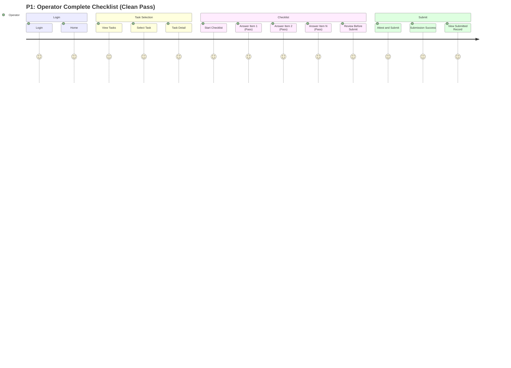
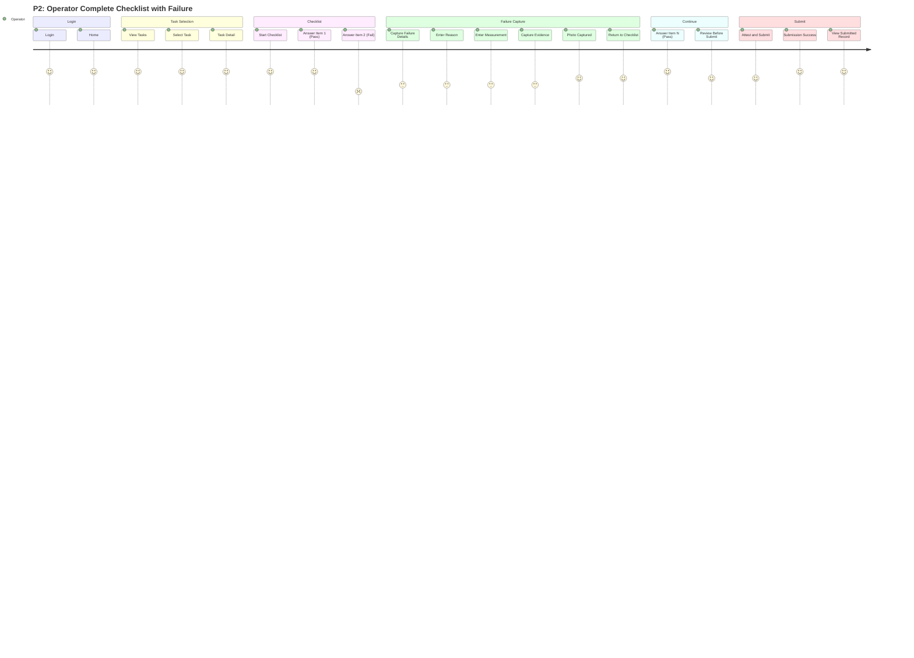
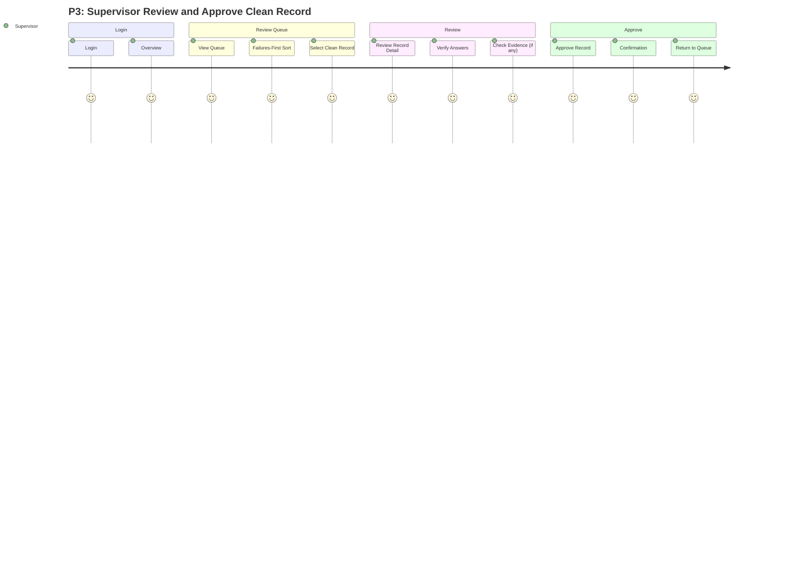
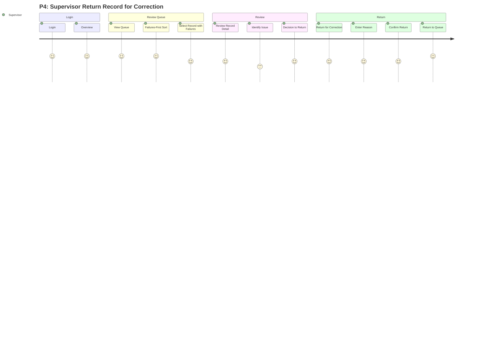
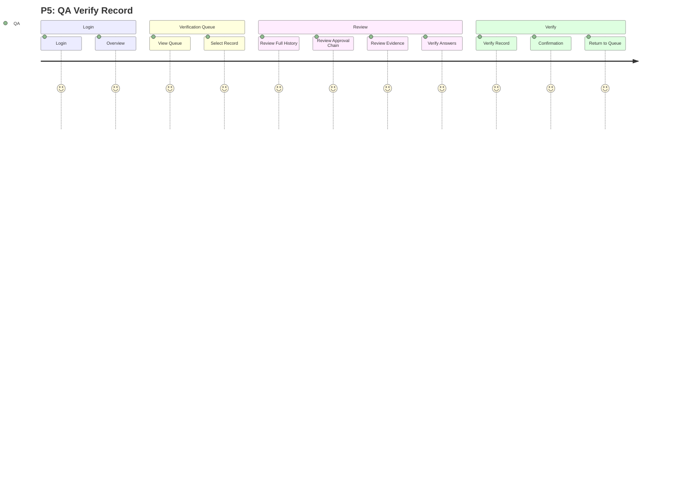
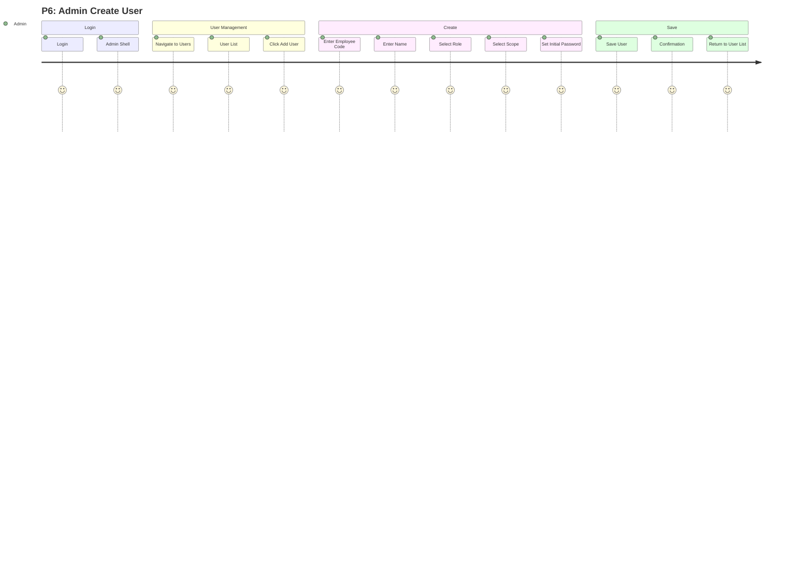
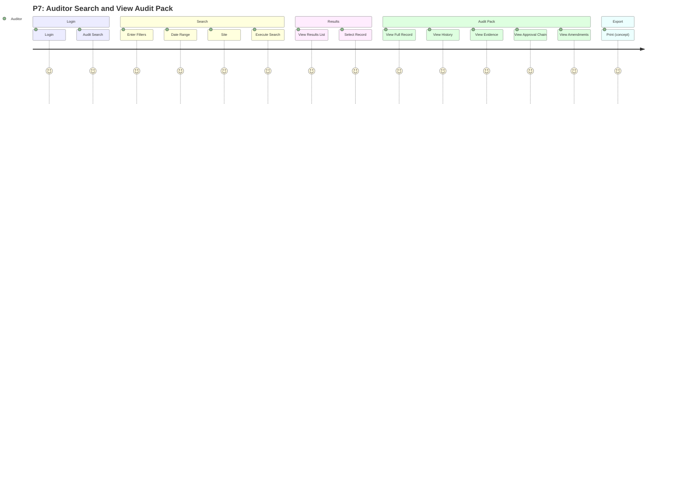

# Prototype Flow Map — Phase 01C

**Document status:** Draft pending owner review — not approved  
**Phase:** 01C — High-fidelity MVP screens and prototype  
**Branch:** `design/figma-high-fidelity-mvp`  
**Created:** 2026-08-05  
**Last updated:** 2026-08-05

**Related documents:**
- [HIGH_FIDELITY_SCREEN_SPEC.md](HIGH_FIDELITY_SCREEN_SPEC.md)
- [USER_JOURNEYS.md](USER_JOURNEYS.md)
- [INFORMATION_ARCHITECTURE.md](INFORMATION_ARCHITECTURE.md)

This document defines clickable prototype flows (P1–P7) for Figma Phase 01C interactive prototypes. Each flow includes a Mermaid journey diagram, start frame reference, key hotspots, and exit criteria.

---

## Prototype conventions

### Hotspot types
- **Primary action:** Tap/click → navigate to next screen
- **Secondary action:** Tap/click → modal, drawer, or conditional branch
- **Back navigation:** Tap/click → return to previous screen or close modal
- **Conditional branch:** Tap/click → different destination based on state (e.g., pass/fail)

### Frame naming pattern
- `{page-number}/{persona}/{screen-id}/{breakpoint}`
- Example: `06/operator/OP-HOME/360`

### Prototype start frames
- Each prototype flow (P1–P7) has a designated start frame
- Link start frames from a prototype index page (Page 12 Interactive Prototypes) [PROPOSED]

---

## P1 — Operator: Complete checklist (clean pass)

**Primary persona:** Operator  
**Journey reference:** J2 (Operator records)  
**Purpose:** Happy path — operator completes checklist with all pass items, reviews, submits.

**Start frame:** `06/operator/OP-HOME/360`

**Flow:**

**Hotspots:**

1. **OP-HOME** (`06/operator/OP-HOME/360`)
   - Primary: "View my tasks" → `OP-TASKS`

2. **OP-TASKS** (`06/operator/OP-TASKS/360`)
   - Primary: Tap task card → `OP-TASK`

3. **OP-TASK** (`06/operator/OP-TASK/360`)
   - Primary: "Start checklist" → `OP-CHK` (item 1)

4. **OP-CHK** (item 1) (`06/operator/OP-CHK-ITEM-01/360`)
   - Primary: Answer "Pass" → Next item → `OP-CHK` (item 2)

5. **OP-CHK** (item 2) (`06/operator/OP-CHK-ITEM-02/360`)
   - Primary: Answer "Pass" → Next item → `OP-CHK` (item N)

6. **OP-CHK** (item N, final) (`06/operator/OP-CHK-ITEM-N/360`)
   - Primary: Answer "Pass" → "Review" → `OP-REV`

7. **OP-REV** (`06/operator/OP-REV/360`)
   - Primary: "Submit" (attestation) → `OP-RES` (success)

8. **OP-RES** (success) (`06/operator/OP-RES-SUCCESS/360`)
   - Primary: "View record" → `OP-REC`
   - Secondary: "Return to tasks" → `OP-TASKS`

9. **OP-REC** (`06/operator/OP-REC/360`)
   - Primary: "Back to tasks" → `OP-TASKS`

**Exit criteria:**
- Operator successfully submits checklist
- Receives confirmation and record ID
- Can view submitted record (read-only)

**Figma notes:**
- Use sample data (TASK-0001, SAMPLE-BATCH-001, XX.X°C)
- Show progress indicator (item X of Y)
- Success confirmation clear

---

## P2 — Operator: Complete checklist with failure

**Primary persona:** Operator  
**Journey reference:** J2 (Operator records)  
**Purpose:** Operator encounters failed item, captures failure details and evidence, submits.

**Start frame:** `06/operator/OP-HOME/360`

**Flow:**

**Hotspots:**

1. **OP-HOME** → **OP-TASKS** → **OP-TASK** → **OP-CHK** (same as P1)

2. **OP-CHK** (item 2) (`06/operator/OP-CHK-ITEM-02/360`)
   - Primary: Answer "Fail" → `OP-FAIL`

3. **OP-FAIL** (`06/operator/OP-FAIL/360`)
   - Primary: "Capture evidence" → `OP-EVD`
   - Secondary: "Save failure details" (after filling reason/measurement) → return to `OP-CHK`

4. **OP-EVD** (`06/operator/OP-EVD/360`)
   - Primary: "Capture photo" → camera view → captured thumbnail → "Confirm" → return to `OP-FAIL`

5. **OP-FAIL** (with evidence attached) (`06/operator/OP-FAIL-COMPLETE/360`)
   - Primary: "Save" → return to `OP-CHK` (next item)

6. **OP-CHK** (item N, final) → **OP-REV** (with failure summary) → **OP-RES** → **OP-REC** (same as P1)

**Exit criteria:**
- Operator captures failure details (reason, measurement, evidence)
- Submits checklist with failures
- Record includes failure data

**Figma notes:**
- Failure item highlighted (not color-only: icon + border)
- Failure summary visible in review step
- Evidence thumbnail shown

---

## P3 — Supervisor: Review and approve clean record

**Primary persona:** Supervisor  
**Journey reference:** J3 (Supervisor review)  
**Purpose:** Supervisor reviews operator-submitted record (clean, no failures), approves.

**Start frame:** `07/supervisor/SV-OVR/768`

**Flow:**

**Hotspots:**

1. **SV-OVR** (`07/supervisor/SV-OVR/768`)
   - Primary: "View review queue" → `SV-QUE`

2. **SV-QUE** (`07/supervisor/SV-QUE/768`)
   - Primary: Tap clean record row → `SV-REV`

3. **SV-REV** (clean record) (`07/supervisor/SV-REV-CLEAN/768`)
   - Primary: "Approve" → confirmation modal → approved → return to `SV-QUE`

**Exit criteria:**
- Supervisor approves clean record
- Record status changes to Supervisor-Approved
- Record moves to QA verification queue

**Figma notes:**
- Clean record (no failures highlighted)
- Approve button clear and prominent
- Confirmation modal or toast

---

## P4 — Supervisor: Review and return record for correction

**Primary persona:** Supervisor  
**Journey reference:** J3 (Supervisor review)  
**Purpose:** Supervisor reviews record with issues, returns to operator for correction.

**Start frame:** `07/supervisor/SV-OVR/768`

**Flow:**

**Hotspots:**

1. **SV-OVR** → **SV-QUE** (same as P3)

2. **SV-QUE** (`07/supervisor/SV-QUE/768`)
   - Primary: Tap record with failures → `SV-REV`

3. **SV-REV** (with failures) (`07/supervisor/SV-REV-FAILURES/768`)
   - Primary: "Return for correction" → `SV-RET`

4. **SV-RET** (`07/supervisor/SV-RET/768`)
   - Primary: Enter reason → "Confirm return" → confirmation → return to `SV-QUE`

**Exit criteria:**
- Supervisor returns record with reason
- Operator notified (concept — notification method TBD)
- Record status changes to Returned

**Figma notes:**
- Failures section highlighted in SV-REV
- Return reason required (validation)
- Confirmation clear

---

## P5 — QA: Verify record

**Primary persona:** QA Officer  
**Journey reference:** J4 (QA verification)  
**Purpose:** QA reviews supervisor-approved record, views full history and evidence, verifies.

**Start frame:** `08/qa/QA-OVR/1024`

**Flow:**

**Hotspots:**

1. **QA-OVR** (`08/qa/QA-OVR/1024`)
   - Primary: "View verification queue" → `QA-QUE`

2. **QA-QUE** (`08/qa/QA-QUE/1024`)
   - Primary: Tap record row → `QA-VER`

3. **QA-VER** (`08/qa/QA-VER/1024`)
   - Primary: "Verify" → confirmation modal → verified → return to `QA-QUE`
   - Secondary: "View evidence" → full-screen evidence preview → close → return to `QA-VER`

**Exit criteria:**
- QA verifies record
- Record status changes to QA-Verified
- Full approval chain complete

**Figma notes:**
- Approval chain visible (operator → supervisor → QA)
- Audit timeline visible
- Evidence panel clear

---

## P6 — Admin: Create user

**Primary persona:** System Administrator  
**Journey reference:** J8 (Admin)  
**Purpose:** Admin creates new user account with role and scope.

**Start frame:** `09/admin/AD-SHL/1024`

**Flow:**

**Hotspots:**

1. **AD-SHL** (`09/admin/AD-SHL/1024`)
   - Primary: "Users" nav item → `AD-USR`

2. **AD-USR** (list) (`09/admin/AD-USR/1024`)
   - Primary: "Add user" button → `AD-USR` (create form, modal or inline)

3. **AD-USR** (create form) (`09/admin/AD-USR-CREATE/1024`)
   - Primary: Fill form → "Save" → confirmation → return to `AD-USR` (list with new user)

**Exit criteria:**
- Admin creates new user
- User account active
- User can log in (forced password change on first login)

**Figma notes:**
- Form validation visible
- Role and scope dropdowns (sample values)
- Confirmation toast or modal

---

## P7 — Auditor: Search and view audit pack

**Primary persona:** Auditor  
**Journey reference:** J7 (Auditor)  
**Purpose:** Auditor searches for records, views full audit pack (read-only).

**Start frame:** `09/admin/AU-SRC/1024`

**Flow:**

**Hotspots:**

1. **AU-SRC** (`09/admin/AU-SRC/1024`)
   - Primary: Enter filters → "Search" → `AU-HIS` (results list)

2. **AU-HIS** (`09/admin/AU-HIS/1024`)
   - Primary: Tap record row → `AU-PCK`

3. **AU-PCK** (`09/admin/AU-PCK/1024`)
   - Primary: "Back to search" → `AU-SRC`
   - Secondary: "View evidence" → full-screen preview → close → return to `AU-PCK`
   - Secondary: "Print" (concept, later phase) → print dialog

**Exit criteria:**
- Auditor retrieves full immutable audit pack
- All history, evidence, approval chain visible
- Read-only (no mutate)

**Figma notes:**
- Read-only banner clear
- Full history visible (operator, supervisor, QA timestamps)
- Evidence links functional
- Print-optimized layout (later phase concept)

---

## Prototype navigation index (Page 12)

Create a prototype index page (`12/prototypes/INDEX/1024`) with links to all prototype start frames:

- **P1:** Operator: Complete checklist (clean pass) → `06/operator/OP-HOME/360`
- **P2:** Operator: Complete checklist with failure → `06/operator/OP-HOME/360`
- **P3:** Supervisor: Review and approve clean record → `07/supervisor/SV-OVR/768`
- **P4:** Supervisor: Review and return record for correction → `07/supervisor/SV-OVR/768`
- **P5:** QA: Verify record → `08/qa/QA-OVR/1024`
- **P6:** Admin: Create user → `09/admin/AD-SHL/1024`
- **P7:** Auditor: Search and view audit pack → `09/admin/AU-SRC/1024`

**Figma presentation mode:**
- Set start frame to `12/prototypes/INDEX/1024`
- Tap prototype name → navigate to start frame → follow flow

---

## Prototype animation (optional)

**Transitions:** [DECISION REQUIRED]
- Instant (no animation) for MVP clarity
- OR: Slide left/right for forward/back navigation
- OR: Fade for modal overlays

**Recommendation:** Instant (no animation) for MVP — faster prototyping, clearer review. Animation refinement in later phase.

---

## Prototype testing checklist

Before Phase 01C approval:

- [ ] All P1–P7 flows functional (no broken hotspots)
- [ ] Sample data consistent (not real Nelna values)
- [ ] Back navigation works
- [ ] Conditional branches work (pass/fail, approve/return)
- [ ] Error states accessible (validation, offline, error)
- [ ] Empty states accessible
- [ ] Success states clear
- [ ] Responsive frames linked correctly (mobile, tablet, desktop)
- [ ] Prototype index page functional

---

## Next steps

1. Build high-fidelity screens per [HIGH_FIDELITY_SCREEN_SPEC.md](HIGH_FIDELITY_SCREEN_SPEC.md)
2. Link screens per P1–P7 flows in Figma
3. Test prototype flows with stakeholders
4. Gather feedback and iterate
5. Phase 01C approval before implementation

---

**Document status:** Draft pending owner review  
**Approval required before:** Figma prototype completion  
**Related approval form:** [PHASE_01C_HIGH_FIDELITY_APPROVAL.md](../approvals/PHASE_01C_HIGH_FIDELITY_APPROVAL.md)
